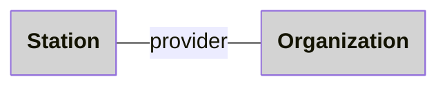
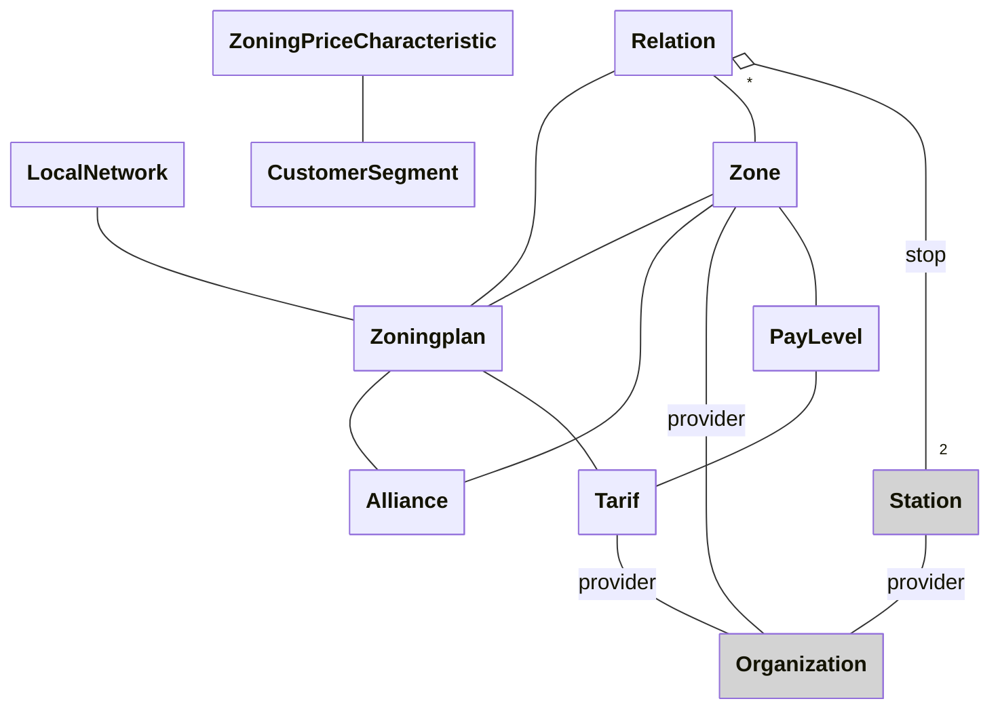
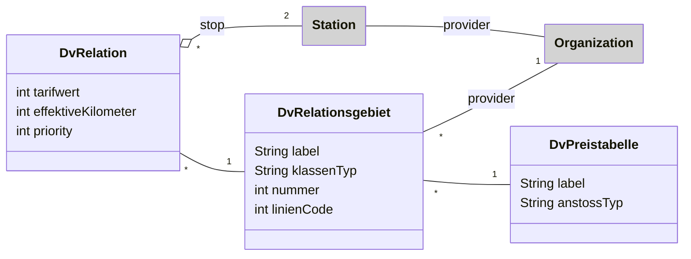

# Datamodel

## Atlas

```mermaid
---
  config:
    class:
      hideEmptyMembersBox: true
---
classDiagram
    direction LR    

    Station -- Organization : provider

    class Station:::atlas
    class Organization:::atlas
    classDef atlas fill:lightgray
```

## Zoning

```mermaid
---
  config:
    class:
      hideEmptyMembersBox: true
---
classDiagram
    direction TB
    
    LocalNetwork -- Zoningplan
    
    Zoningplan -- Alliance
    Zoningplan -- Tarif
    
    Zone -- Zoningplan
    Zone -- Alliance
    Zone -- Organization : provider
    Zone -- PayLevel

    PayLevel -- Tarif
    Tarif -- Organization : provider

    ZoningPriceCharacteristic -- CustomerSegment
    
    Relation -- Zoningplan
    Relation -- Zone
    Relation "*" o-- "2" Station : stop

    Station -- Organization : provider

    class Station:::atlas
    class Organization:::atlas
    classDef atlas fill:lightgray
```

## RTM

```mermaid
---
  config:
    class:
      hideEmptyMembersBox: true
---
classDiagram
    direction LR
    DvRelationsgebiet "*" -- "1" Organization : provider
    DvRelationsgebiet "*" -- "1" DvPreistabelle

    DvRelation "*" -- "1" DvRelationsgebiet

    DvRelation "*" o-- "2" Station : stop

    Station -- Organization : provider
    
    class DvRelationsgebiet {
        String label
        String klassenTyp
        int nummer
        int linienCode
    }

    class DvPreistabelle {
        String label
        String anstossTyp
    }

    class DvRelation {
        int tarifwert
        int effektiveKilometer
        int priority
    }

    class Station:::atlas
    class Organization:::atlas
    classDef atlas fill:lightgray
```