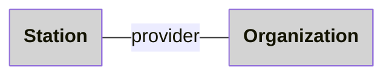
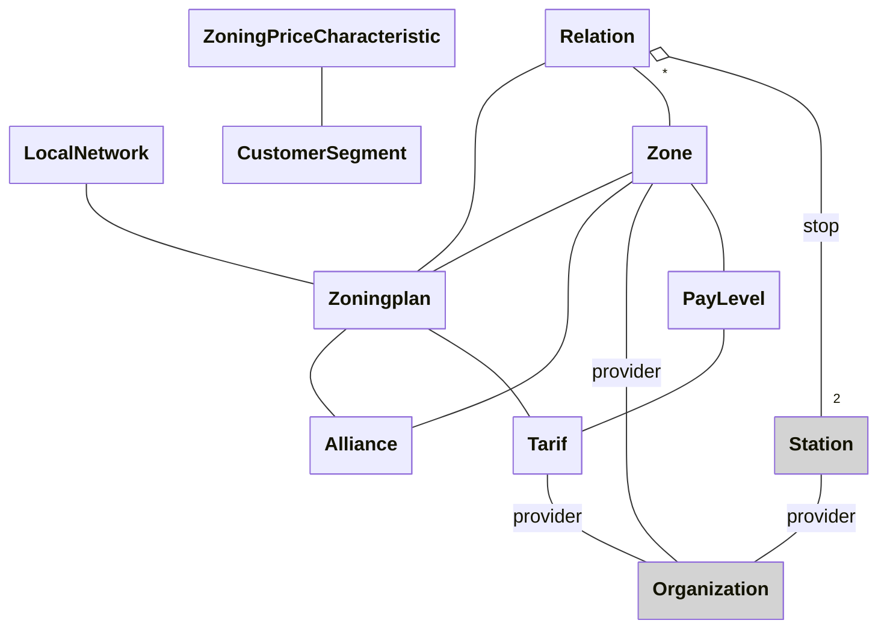
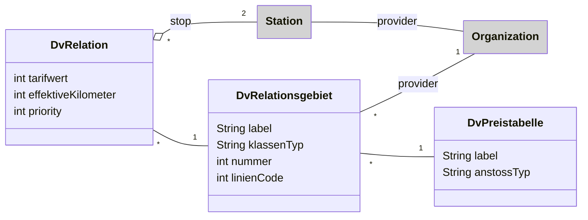

# Datamodel

In this page inlined below are overview diagrams that are manually curated.

For more details and accuracy, have a look at the documentation generated from the SHACL shapes:
- [didok-shapes](https://zazuko.github.io/opentransportdata-swiss/didok-shapes.html)
- [nova-shapes](https://zazuko.github.io/opentransportdata-swiss/nova-shapes.html)

*(Above links point to documentation generated from the SHACL shapes using [SHACL Play!](https://shacl-play.sparna.fr/play/doc) )*

## Atlas

## Zoning

## RTM

