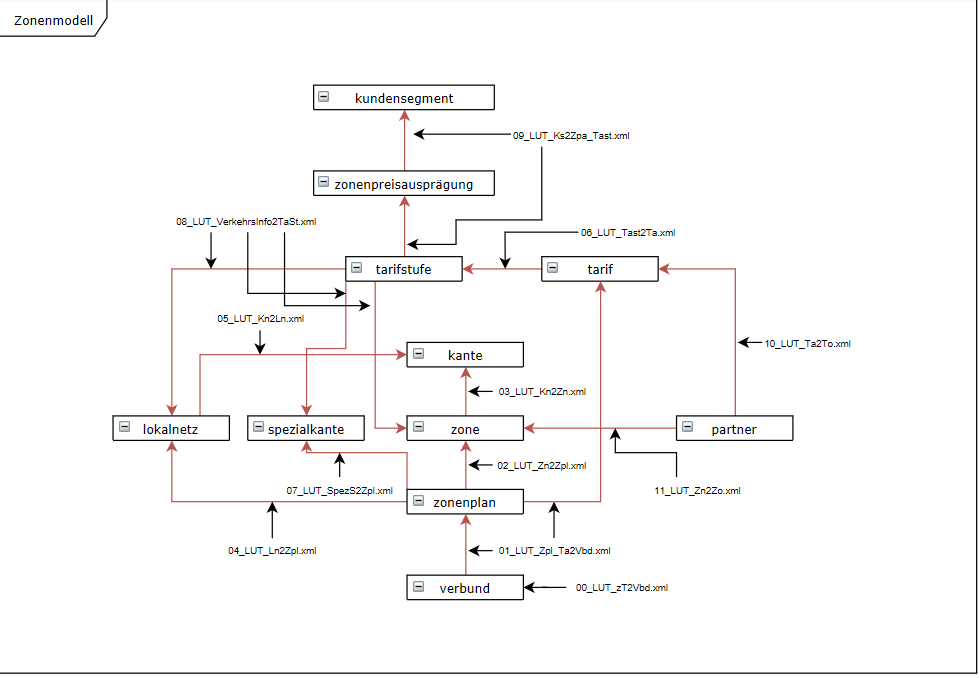

## Was ist drin, in diesen Daten?

Die Daten befinden sich auf [LINDAS](https://lindas.admin.ch/) in den folgenden beiden Named-Graphs:
- https://lindas.admin.ch/sbb/nova
- https://lindas.admin.ch/sbb/didok

Mit dem ersten Query erstellen wir uns ein Inhaltsverzeichnis über diese zwei Graphen. Es zeigt, von welchen Klassen es wieviele Instanzen im jeweiligen Named-Graph hat:

```sparql
SELECT ?g ?cls (COUNT(?s) AS ?count) WHERE {
  {
    SELECT  DISTINCT ?g 
    WHERE  {
      GRAPH ?g {
      } 
    }
  }
  GRAPH ?g {
    ?s a ?cls
  }
} GROUP BY ?g  ?cls
ORDER BY ?g ?cls

VALUES ?g {
    <https://lindas.admin.ch/sbb/nova>
    <https://lindas.admin.ch/sbb/didok>
}

```
## Datenmodell


## Die IRI einer Haltestelle herausfinden

Häufig benötigen wir für Abfragen die IRIs von bestimmten Resourcen, kennen diese aber nicht auswendig. Mit Hilfe der Volltextsuche können wir die IRI herausfinden, beispielsweise für die Haltestelle "Oerlikon": 

```sparql
PREFIX gtfs: <http://vocab.gtfs.org/terms#>

SELECT DISTINCT ?s ?l
WHERE {
  ?s a gtfs:Station.
  ?s ?p ?l.
  (?l ?score) <tag:stardog:api:property:textMatch> 'oerlikon'.
} LIMIT 10

```
Mit `DESCRIBE` können wir uns anschliessend alle Statements zu einer oder mehreren Resourcen ansehen. Beispielsweise für eine Haltestelle und ihre Geometrie:

```sparql
DESCRIBE

## Zurich Oerlikon
<https://lod.opentransportdata.swiss/didok/8503006>
<https://lod.opentransportdata.swiss/didok/8503006/geometry>
```
