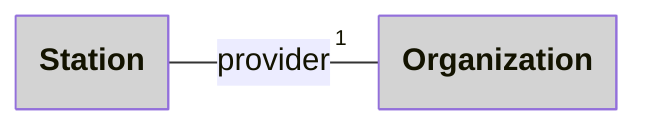
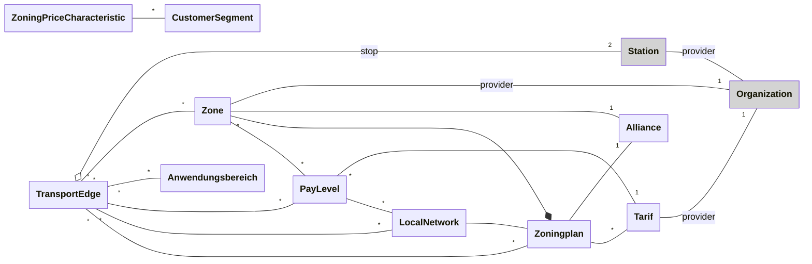
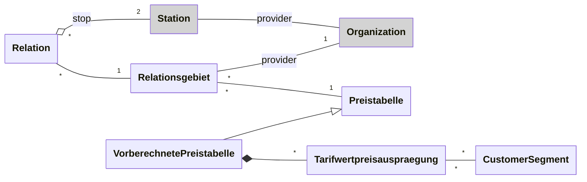

## Was ist drin, in diesen Daten?

Die Daten befinden sich auf [LINDAS](https://lindas.admin.ch/) in den folgenden beiden Named-Graphs:
- https://lindas.admin.ch/sbb/nova
- https://lindas.admin.ch/sbb/nova-dv
- https://lindas.admin.ch/sbb/didok

Mit dem ersten Query erstellen wir uns ein Inhaltsverzeichnis über diese zwei Graphen. Es zeigt, von welchen Klassen es wieviele Instanzen im jeweiligen Named-Graph hat:

```sparql
SELECT ?g ?cls (COUNT(?s) AS ?count) WHERE {
  {
    SELECT  DISTINCT ?g 
    WHERE  {
      GRAPH ?g {
      } 
    }
  }
  GRAPH ?g {
    ?s a ?cls
  }
} GROUP BY ?g  ?cls
ORDER BY ?g ?cls

VALUES ?g {
    <https://lindas.admin.ch/sbb/nova>
    <https://lindas.admin.ch/sbb/nova-dv>
    <https://lindas.admin.ch/sbb/didok>
}

```
## Datenmodell


### Atlas (Didok)




### Verbund




### Direkter Verkehr (DV)


## Die IRI einer Haltestelle herausfinden

Häufig benötigen wir für Abfragen die IRIs von bestimmten Resourcen, kennen diese aber nicht auswendig. Mit Hilfe der Volltextsuche können wir die IRI herausfinden, beispielsweise für die Haltestelle "Oerlikon": 

```sparql
PREFIX gtfs: <http://vocab.gtfs.org/terms#>

SELECT DISTINCT ?s ?l
WHERE {
  ?s a gtfs:Station.
  ?s ?p ?l.
  (?l ?score) <tag:stardog:api:property:textMatch> 'oerlikon'.
} LIMIT 10

```
Volltextsuche mit boolschem "Logical AND" Operator `&&`:

```sparql
PREFIX gtfs: <http://vocab.gtfs.org/terms#>
PREFIX rdfs: <http://www.w3.org/2000/01/rdf-schema#>

SELECT DISTINCT ?s ?l
WHERE {
  ?s a <https://lod.opentransportdata.swiss/vocab/Preistabelle> .
  
  ?s ?p ?l.
  (?l ?score) <tag:stardog:api:property:textMatch> 'Alpbus && T74'.
} LIMIT 10

```
Mit `DESCRIBE` können wir uns anschliessend alle Statements zu einer oder mehreren Resourcen ansehen. Beispielsweise für eine Haltestelle und ihre Geometrie:

```sparql
DESCRIBE

## Zurich Oerlikon
<https://lod.opentransportdata.swiss/didok/8503006>
<https://lod.opentransportdata.swiss/didok/8503006/geometry>
```
`DESCRIBE` antwortet mit einem Graph. Diesen können wir mit [Sketch](https://sketch.zazuko.com/) visualisieren, mit copy/paste der Statements ins Formularfeld "RDF Editor".
## Alle Haltestellen mit Kurzstrecken

Verwendet man für die Abrage das Web-UI, dann wird das Resultat des Queries [auf der Karte visualisiert](https://s.zazuko.com/3hc8Zct) `Geo`

```sparql
PREFIX sc: <http://purl.org/science/owl/sciencecommons/>
PREFIX gtfs: <http://vocab.gtfs.org/terms#>
PREFIX schema: <http://schema.org/>
PREFIX rdfs: <http://www.w3.org/2000/01/rdf-schema#>
PREFIX otd: <https://lod.opentransportdata.swiss/vocab/>
PREFIX dcterms: <http://purl.org/dc/terms/>

SELECT distinct ?Station ?Name ?Coord ?departureID 
WHERE {
        ?Kante a otd:TransportEdge;
              otd:zoningPlan <https://lod.opentransportdata.swiss/zoningplan/libero/libero-billett-libero>;
              gtfs:stop ?Station .
   
        ?Station rdfs:label ?Name ;
             <http://www.opengis.net/ont/geosparql#hasGeometry>/<http://www.opengis.net/ont/geosparql#asWKT> ?Coord;              
             dcterms:identifier ?departureID .
   } 
limit 10000
```
## Alle Zonepläne

```sparql
PREFIX schema: <http://schema.org/>
PREFIX rdf: <http://www.w3.org/1999/02/22-rdf-syntax-ns#>
PREFIX rdfs: <http://www.w3.org/2000/01/rdf-schema#>
prefix otd: <https://lod.opentransportdata.swiss/vocab/>


SELECT * 
FROM <https://lindas.admin.ch/sbb/nova>
WHERE {
  ?Zonenplan a otd:ZoningPlan; 
               rdfs:label     ?namen.
   
} 
LIMIT 100
```
## GeOps Zonendaten

```sparql
PREFIX dcterm: <http://purl.org/dc/terms/>
PREFIX dct: <http://purl.org/dc/terms/>
PREFIX dc: <http://purl.org/dc/elements/1.1/>
PREFIX gtfs: <http://vocab.gtfs.org/terms#>
PREFIX schema: <http://schema.org/>
PREFIX rdf: <http://www.w3.org/1999/02/22-rdf-syntax-ns#>
PREFIX rdfs: <http://www.w3.org/2000/01/rdf-schema#>
PREFIX otd: <https://lod.opentransportdata.swiss/vocab/>
PREFIX vcard: <http://www.w3.org/2006/vcard/ns#>
PREFIX dcterms: <http://purl.org/dc/terms/>
PREFIX xsd:<http://www.w3.org/2001/XMLSchema#>

#SELECT DISTINCT ?VerbundBezeichnung ?ZonenplanBezeichnung ?ZonenCode ?VerkehrsmittelBezeichnung ?Didok ?HaltestelleBezeichnung
SELECT ?VerbundBezeichnung ?ZonenplanBezeichnung ?ZonenCode ?ZonenEignerCode ?ZonenEignerKuerzel ?VerkehrsmittelBezeichnung ?stop1id ?stop1Name ?stop2id ?stop2Name
WHERE {
  ?Verbund a otd:Alliance ;
    rdfs:label ?VerbundBezeichnung .
  
  ?Zonenplan a otd:ZoningPlan ;
    otd:alliance ?Verbund ;
    otd:zone ?Zone ;
    rdfs:label ?ZonenplanBezeichnung .
  
  ?Zone a otd:Zone ;
    schema:identifier ?ZonenCode;
    schema:provider ?ZonenEigner.
  
  ?ZonenEigner a schema:Organization;
               schema:alternateName ?ZonenEignerKuerzel;
               schema:identifier ?ZonenEignerCode.
  
  ?TransportEdge a otd:TransportEdge;
    otd:zone ?Zone;
    otd:meanOfTransport ?VerkehrsmittelBezeichnung;
    gtfs:stop ?stop1 ;
    gtfs:stop ?stop2 .
  
  ?stop1 rdfs:label ?stop1Name ;
    dcterms:identifier ?stop1id .
  
  ?stop2 rdfs:label ?stop2Name ;
    dcterms:identifier ?stop2id .
  
  FILTER( xsd:integer(?stop1id) > xsd:integer(?stop2id) )
} LIMIT 100
```
## Haltestellen im Verbund

```sparql
PREFIX gtfs: <http://vocab.gtfs.org/terms#>
PREFIX schema: <http://schema.org/>
PREFIX rdf: <http://www.w3.org/1999/02/22-rdf-syntax-ns#>
PREFIX rdfs: <http://www.w3.org/2000/01/rdf-schema#>
PREFIX otd: <https://lod.opentransportdata.swiss/vocab/>
PREFIX vcard: <http://www.w3.org/2006/vcard/ns#>
PREFIX dcterms: <http://purl.org/dc/terms/>

#SELECT DISTINCT gibt nur einzigartige Kombinationen aus.
SELECT DISTINCT ?verbund_name ?didok ?haltestelle_bezeichnung
FROM <https://lindas.admin.ch/sbb/nova>
WHERE {
  	# Ausgabe zu Zonenplan
  	?Kante a otd:TransportEdge;
  		otd:zoningPlan ?Zonenplan;
  		gtfs:stop ?haltestelle.
  
  	?Zonenplan otd:alliance ?verbund.
  
  	?verbund rdfs:label ?verbund_name.
    
  	FILTER(?Zonenplan IN (<https://lod.opentransportdata.swiss/zoningplan/libero/libero-abo-libero>))

  	SERVICE <https://int.lindas.admin.ch/query> {
    ?haltestelle rdfs:label ?haltestelle_bezeichnung;
		dcterms:identifier ?didok.
}
} 
LIMIT 1000
```
## Haltestellen zum Zonenplan Onde Verte Billet

Verwendet man für die Abrage das Web-UI, dann wird das Resultat des Queries [auf der Karte visualisiert](https://s.zazuko.com/2uByEE1) `Geo`

```sparql
PREFIX gtfs: <http://vocab.gtfs.org/terms#>
PREFIX schema: <http://schema.org/>
PREFIX rdf: <http://www.w3.org/1999/02/22-rdf-syntax-ns#>
PREFIX rdfs: <http://www.w3.org/2000/01/rdf-schema#>
PREFIX otd: <https://lod.opentransportdata.swiss/vocab/>
PREFIX vcard: <http://www.w3.org/2006/vcard/ns#>
PREFIX dcterms: <http://purl.org/dc/terms/>

# Dieses Query gibt alle Haltestellen zum Zonenplan Onde Verte Billet aus und stellt sie grafisch dar. 
SELECT DISTINCT ?geometrie
WHERE {
    # Ausgabe zu Zonenplan
    ?Kante a otd:TransportEdge;
        otd:zoningPlan ?Zonenplan;
        gtfs:stop ?haltestelle.
  
    FILTER(?Zonenplan IN (<https://lod.opentransportdata.swiss/zoningplan/onde-verte/onde-verte-billett>))
  	
    ?haltestelle <http://www.opengis.net/ont/geosparql#hasGeometry>/<http://www.opengis.net/ont/geosparql#asWKT> ?geometrie
} 

```
## Kante2Zonenplan

```sparql
PREFIX gtfs: <http://vocab.gtfs.org/terms#>
PREFIX schema: <http://schema.org/>
PREFIX rdf: <http://www.w3.org/1999/02/22-rdf-syntax-ns#>
PREFIX rdfs: <http://www.w3.org/2000/01/rdf-schema#>
PREFIX otd: <https://lod.opentransportdata.swiss/vocab/>
PREFIX vcard: <http://www.w3.org/2006/vcard/ns#>
PREFIX dcterms: <http://purl.org/dc/terms/>

# Select: wählt im Ergebnis die Variablen aus, welche angezeigt werden sollen .
#SELECT ?Zonenplan ?zonenplan_name ?zone ?zone_name
SELECT *
FROM <https://lindas.admin.ch/sbb/nova>
WHERE {
  	# Ausgabe zu Zonenplan
  	?Kante a otd:TransportEdge;
  		otd:zoningPlan ?Zonenplan;
  		gtfs:stop ?haltestelle.
  
  	FILTER(?Zonenplan IN (<https://lod.opentransportdata.swiss/zoningplan/onde-verte/onde-verte-billett>))
} 
LIMIT 1000
```
## Kurzstrecken ab einer Station

```sparql
PREFIX dcterms: <http://purl.org/dc/terms/>
PREFIX gtfs: <http://vocab.gtfs.org/terms#>
PREFIX otd: <https://lod.opentransportdata.swiss/vocab/>
PREFIX rdfs: <http://www.w3.org/2000/01/rdf-schema#>
PREFIX schema: <http://schema.org/>

SELECT ?departure ?departureCoord ?departureID ?arrival ?arrivalCoord ?arrivalID
WHERE {
        ?Kante a otd:TransportEdge;
              otd:zoningPlan <https://lod.opentransportdata.swiss/zoningplan/libero/libero-billett-libero>;
              gtfs:stop ?departurePoint ;
              gtfs:stop ?arrivalPoint .
  
        ?departurePoint rdfs:label ?departure ;
             <http://www.opengis.net/ont/geosparql#hasGeometry>/<http://www.opengis.net/ont/geosparql#asWKT> ?departureCoord;              
             dcterms:identifier ?departureID .
  
         ?arrivalPoint rdfs:label ?arrival ;
             <http://www.opengis.net/ont/geosparql#hasGeometry>/<http://www.opengis.net/ont/geosparql#asWKT> ?arrivalCoord;                   
            dcterms:identifier ?arrivalID. 
  
  FILTER(?departurePoint IN  (<https://lod.opentransportdata.swiss/didok/8580425>))
  } 
  
limit 100
```
## Längste Kurzstrecken

Hinweis: Query funktioniert nicht mehr, da die Angabe zu `otd:routeType` auf der TransportEdge fehlt.

```sparql
PREFIX sc: <http://purl.org/science/owl/sciencecommons/>
PREFIX dcterm: <http://purl.org/dc/terms/>
PREFIX dct: <http://purl.org/dc/terms/>
PREFIX gtfs: <http://vocab.gtfs.org/terms#>
PREFIX schema: <http://schema.org/>
PREFIX rdfs: <http://www.w3.org/2000/01/rdf-schema#>
PREFIX otd: <https://lod.opentransportdata.swiss/vocab/>
PREFIX dcterms: <http://purl.org/dc/terms/>
prefix geo: <http://www.opengis.net/ont/geosparql#>
prefix geof: <http://www.opengis.net/def/function/geosparql/>
prefix unit: <http://qudt.org/vocab/unit#>
SELECT ?TransportEdge ?Zonenplan ?stNam1 ?stNam2 ?distance
WHERE {
  ?TransportEdge a otd:TransportEdge;
       otd:zoningPlan ?Zonenplan;
       otd:routeType ?RouteType;
    gtfs:stop ?stop1 ;
    gtfs:stop ?stop2.

  ?stop1 geo:hasGeometry ?geom1 ;
         rdfs:label ?stNam1;
         dcterms:identifier ?didok1 .
  
  ?stop2 geo:hasGeometry ?geom2 ;
          rdfs:label ?stNam2;
         dcterms:identifier ?didok2 .
  
  BIND(geof:distance(?geom1, ?geom2, unit:Meter) as ?distance)
 
  
  ?geom1 geo:asWKT ?loc1 .    
  ?geom2 geo:asWKT ?loc2 .
  
  BIND(CONCAT("Connection ", ?stNam1, " - ", ?stNam2, "/", STR(?distance),"m") AS ?loc1Label)
  BIND( ?loc1Label AS ?loc2Label)

  BIND(STRDT(concat("LINESTRING ",strafter(strbefore(str(?loc1),")"),"POINT"), ",", strafter(str(?loc2),"POINT(")), <http://www.opengis.net/ont/geosparql#wktLiteral> )	as ?line)
 
FILTER (?RouteType="KURZ"^^xsd:string)

} 
ORDER BY DESC (?distance) 
LIMIT 100

```
## Lokalnetz geordnet

```sparql
PREFIX gtfs: <http://vocab.gtfs.org/terms#>
PREFIX dcterms: <http://purl.org/dc/terms/>
PREFIX schema: <http://schema.org/>
PREFIX rdf: <http://www.w3.org/1999/02/22-rdf-syntax-ns#>
PREFIX rdfs: <http://www.w3.org/2000/01/rdf-schema#>
prefix otd: <https://lod.opentransportdata.swiss/vocab/>

SELECT *
FROM <https://lindas.admin.ch/sbb/nova>
WHERE {
  ?Kante a otd:LocalNetwork;
          rdfs:label ?name;
} 
 ORDER BY ASC (?name)
LIMIT 1000

```
## Monodirektionale Kurzstrecken
Hinweis: Query funktioniert nicht

```sparql
PREFIX xsd: <http://www.w3.org/2001/XMLSchema#>
PREFIX gtfs: <http://vocab.gtfs.org/terms#>
PREFIX schema: <http://schema.org/>
PREFIX rdf: <http://www.w3.org/1999/02/22-rdf-syntax-ns#>
PREFIX rdfs: <http://www.w3.org/2000/01/rdf-schema#>
PREFIX otd: <https://lod.opentransportdata.swiss/vocab/>
PREFIX vcard: <http://www.w3.org/2006/vcard/ns#>
PREFIX dcterms: <http://purl.org/dc/terms/>

SELECT * WHERE {
  
  { SELECT ?startingPoint (COUNT(?Kante) AS ?kurzstreckeDeparture) WHERE {
        ?Kante a otd:TransportEdge;
          otd:zoningPlan <https://lod.opentransportdata.swiss/zoningplan/libero/libero-billett-libero>;
          schema:departureStation ?startingPoint ;
          schema:arrivalStation ?arrivalStation .
  	} GROUP BY ?startingPoint
  }
#  ?arrivalStation rdfs:label ?arrivalStationLabel .
  
  { SELECT (COUNT(?kante2) AS ?kurzstrecke2Departure) WHERE {
  		?kante2 a otd:TransportEdge;
          otd:zoningPlan <https://lod.opentransportdata.swiss/zoningPlan/libero/libero-billett-libero>;
          schema:departureStation ?arrivalStation;
          schema:arrivalStation ?startingPoint .
  	} GROUP BY ?startingPoint
  }
  #?kante2Kantenende rdfs:label ?kante2KantenendeLabel .

   FILTER( ?kurzstreckeDeparture != ?kurzstrecke2Departure)

  } 
```
## Visualisierung Haltestellen eines Verbund

(Duplikat/Variante von `Haltestelle2ZplOndeVerteBillet_geometry.rq`)

```sparql
PREFIX gtfs: <http://vocab.gtfs.org/terms#>
PREFIX schema: <http://schema.org/>
PREFIX rdf: <http://www.w3.org/1999/02/22-rdf-syntax-ns#>
PREFIX rdfs: <http://www.w3.org/2000/01/rdf-schema#>
PREFIX otd: <https://lod.opentransportdata.swiss/vocab/>
PREFIX vcard: <http://www.w3.org/2006/vcard/ns#>
PREFIX dcterms: <http://purl.org/dc/terms/>

# Select: wählt die Variablen aus, welche angezeigt werden sollen im Ergebnis.

SELECT DISTINCT ?geometrie

WHERE {
    # Ausgabe zu Zonenplan
    ?Kante a otd:TransportEdge;
        otd:zoningPlan ?Zonenplan;
        gtfs:stop ?haltestelle.
  
    FILTER(?Zonenplan IN (<https://lod.opentransportdata.swiss/zoningplan/libero/libero-billett-libero>))

    ?haltestelle <http://www.opengis.net/ont/geosparql#hasGeometry>/<http://www.opengis.net/ont/geosparql#asWKT> ?geometrie
} 

```
## Zone2Zonenplan

```sparql
PREFIX schema: <http://schema.org/>
PREFIX rdf: <http://www.w3.org/1999/02/22-rdf-syntax-ns#>
PREFIX rdfs: <http://www.w3.org/2000/01/rdf-schema#>
PREFIX otd: <https://lod.opentransportdata.swiss/vocab/>
PREFIX vcard: <http://www.w3.org/2006/vcard/ns#>
PREFIX dcterms: <http://purl.org/dc/terms/>

# Select: wählt die Variablen aus, welche angezeigt werden sollen im Ergebnis.
SELECT ?Zonenplan ?zonenplan_name ?zone ?zone_name
FROM <https://lindas.admin.ch/sbb/nova>
WHERE {
  	# Ausgabe zu Zonenplan
  	?Zonenplan a	otd:ZoningPlan;
    	rdfs:label ?zonenplan_name;
  		otd:zone ?zone.
  
  	# Ausgabe zu Zone
  	?zone rdfs:label ?zone_name.
} 
```
## Zone-haltestelle-geomapping-label

```sparql
PREFIX gtfs: <http://vocab.gtfs.org/terms#>
PREFIX schema: <http://schema.org/>
PREFIX rdf: <http://www.w3.org/1999/02/22-rdf-syntax-ns#>
PREFIX rdfs: <http://www.w3.org/2000/01/rdf-schema#>
PREFIX otd: <https://lod.opentransportdata.swiss/vocab/>
PREFIX vcard: <http://www.w3.org/2006/vcard/ns#>
PREFIX dcterms: <http://purl.org/dc/terms/>

 

# Select: wählt die Variablen aus, welche angezeigt werden sollen im Ergebnis.
#SELECT ?Zonenplan ?zonenplan_name ?zone ?zone_name
SELECT DISTINCT ?geometrie ?geometrieLabel
#SELECT *
#FROM <https://lindas.admin.ch/sbb/nova>
WHERE {
      # Ausgabe zu Zonenplan
      ?Kante a otd:TransportEdge;
          otd:zoningPlan ?Zonenplan;
          otd:zone <https://lod.opentransportdata.swiss/zone/libero/libero-abo-libero/300> ;
          gtfs:stop ?haltestelle .
   #       gtfs:stop <https://lod.opentransportdata.swiss/didok/8593380> . 
  
  #FILTER( 
  
    #  FILTER(?Zonenplan IN (<https://lod.opentransportdata.swiss/zoningplan/onde-verte/onde-verte-billett>))

  
    ?haltestelle <http://www.opengis.net/ont/geosparql#hasGeometry>/<http://www.opengis.net/ont/geosparql#asWKT> ?geometrie ;
    	rdfs:label ?geometrieLabel .

} 

```
## Zonenplan Diff

```sparql
PREFIX xsd: <http://www.w3.org/2001/XMLSchema#>
PREFIX gtfs: <http://vocab.gtfs.org/terms#>
PREFIX schema: <http://schema.org/>
PREFIX rdf: <http://www.w3.org/1999/02/22-rdf-syntax-ns#>
PREFIX rdfs: <http://www.w3.org/2000/01/rdf-schema#>
PREFIX otd: <https://lod.opentransportdata.swiss/vocab/>
PREFIX vcard: <http://www.w3.org/2006/vcard/ns#>
PREFIX dcterms: <http://purl.org/dc/terms/>

SELECT DISTINCT ?haltestelle ?geometrie  ?geometrieLabel WHERE {
  
  
        ?Kante a otd:TransportEdge;
          otd:zoningPlan <https://lod.opentransportdata.swiss/zoningplan/libero/libero-abo-libero> ;
#          otd:zoningPlan <https://lod.opentransportdata.swiss/zoningplan/libero/libero-billett-libero> ;
            
          gtfs:stop ?haltestelle .
  
  MINUS {
          ?Kante a otd:TransportEdge;
#          otd:zoningPlan <https://lod.opentransportdata.swiss/zoningplan/libero/libero/libero-billett-libero> ;
          otd:zoningPlan <https://lod.opentransportdata.swiss/zoningplan/libero/libero-uberzonenplan-libero-tageskarte> ;

          gtfs:stop ?haltestelle .
  }
  
    ?haltestelle <http://www.opengis.net/ont/geosparql#hasGeometry>/<http://www.opengis.net/ont/geosparql#asWKT> ?geometrie ;
    	rdfs:label ?geometrieLabelSingle ;
  		dcterms:identifier ?uic .
  
    BIND( CONCAT( ?geometrieLabelSingle, " (" ,?uic, ")") AS ?geometrieLabel )

  
  #FILTER( CONTAINS( ?haltestelleLabel, "Wabern")) 
}
```
## Zonenplan einer Kante

```sparql
PREFIX dcterms: <http://purl.org/dc/terms/>
PREFIX schema: <http://schema.org/>
PREFIX rdf: <http://www.w3.org/1999/02/22-rdf-syntax-ns#>
PREFIX rdfs: <http://www.w3.org/2000/01/rdf-schema#>
prefix otd: <https://lod.opentransportdata.swiss/vocab/>
prefix vcard: <http://www.w3.org/2006/vcard/ns#>

SELECT * 
FROM <https://lindas.admin.ch/sbb/nova>
WHERE {
  ?Kante a otd:TransportEdge;
               otd:zoningPlan ?zonenplan. 
   
} 
LIMIT 100

```
## Tarifdreieck - Direkter Verkehr (DV)

```sparql
PREFIX gtfs: <http://vocab.gtfs.org/terms#>
PREFIX otd: <https://lod.opentransportdata.swiss/vocab/>
PREFIX schema: <http://schema.org/>

SELECT ?stop1 ?stop2 ?stop1Name ?stop2Name ?tarifwert WHERE {

    # Relationsgebiet "Heiden - Rorschach Hafen"
    ?relation otd:relationsgebiet <https://lod.opentransportdata.swiss/relationsgebiet/ids-6195732000001> .
    ?relation gtfs:stop ?stop1 .
    ?relation gtfs:stop ?stop2 .
    ?relation otd:tarifwert ?tarifwert .
    FILTER (?stop1 != ?stop2)

    ?stop1 schema:name ?stop1Name .
    ?stop2 schema:name ?stop2Name .

    VALUES (?stop2 ?stop2Position) {
        (<https://lod.opentransportdata.swiss/didok/8506354> 1)
        (<https://lod.opentransportdata.swiss/didok/8506353> 2)
        (<https://lod.opentransportdata.swiss/didok/8506352> 3)
        (<https://lod.opentransportdata.swiss/didok/8506400> 4)
        (<https://lod.opentransportdata.swiss/didok/8506278> 5)
        (<https://lod.opentransportdata.swiss/didok/8506311> 6)
        (<https://lod.opentransportdata.swiss/didok/8506306> 7)
    }
} ORDER BY ?stop1Position ?stop2Position

VALUES (?stop1 ?stop1Position) {
    (<https://lod.opentransportdata.swiss/didok/8506354> 1)
    (<https://lod.opentransportdata.swiss/didok/8506353> 2)
    (<https://lod.opentransportdata.swiss/didok/8506352> 3)
    (<https://lod.opentransportdata.swiss/didok/8506400> 4)
    (<https://lod.opentransportdata.swiss/didok/8506278> 5)
    (<https://lod.opentransportdata.swiss/didok/8506311> 6)
    (<https://lod.opentransportdata.swiss/didok/8506306> 7)
}
```
## Alle relationen des DV bei denen die werte von Tarifwerte / effektive Kilometer anders sind wenn der Antoss Preis oder Kilometer ist

Interpretation der Fragestellung:
- Relationen haben identische Haltestellen
- Relationen sind in Relationsgebieten mit identischem Label
- Preistabellen unterscheiden sich im Anstosstyp
- Relationen unterscheiden sich im Tarifwert

```sparql
PREFIX gtfs: <http://vocab.gtfs.org/terms#>
PREFIX otd: <https://lod.opentransportdata.swiss/vocab/>
PREFIX rdfs: <http://www.w3.org/2000/01/rdf-schema#>
PREFIX schema: <http://schema.org/>

SELECT ?gebietLabel ?stop1 ?stop2 ?stop1Name ?stop2Name  ?tarifwert1 ?tarifwert2  WHERE {

    ?relation1 otd:relationsgebiet/rdfs:label ?gebietLabel .
    ?relation1 otd:relationsgebiet/otd:preistabelle/otd:anstossTyp "PREIS" .
    ?relation1 gtfs:stop ?stop1 .
    ?relation1 gtfs:stop ?stop2 .
    ?relation1 otd:tarifwert ?tarifwert1 .

    ?relation2 otd:relationsgebiet/rdfs:label ?gebietLabel .
    ?relation2 otd:relationsgebiet/otd:preistabelle/otd:anstossTyp "KILOMETER" .
    ?relation2 gtfs:stop ?stop1 .
    ?relation2 gtfs:stop ?stop2 .
    ?relation2 otd:tarifwert ?tarifwert2 .
    
    FILTER (?stop1 != ?stop2)
    FILTER (?relation1 != ?relation2)
    FILTER (?tarifwert1 != ?tarifwert2)

    ?stop1 schema:name ?stop1Name .
    ?stop2 schema:name ?stop2Name .
}
LIMIT 100

VALUES ?gebietLabel {
    "Heiden - Rorschach Hafen"
}
```
## Alle relationen, die es sowohl im DV wie im Zonenmodell gibt

Interpretation der Fragestellung:
- Relation und Verkehrskante haben identische Haltestellen

```sparql
PREFIX gtfs: <http://vocab.gtfs.org/terms#>
PREFIX otd: <https://lod.opentransportdata.swiss/vocab/>
PREFIX rdfs: <http://www.w3.org/2000/01/rdf-schema#>
PREFIX schema: <http://schema.org/>

SELECT distinct ?stop1 ?stop2 ?stop1Name ?stop2Name ?s ?zusatz WHERE {
    {
        ?s a otd:Relation .
        ?s gtfs:stop ?stop1 .
        ?s gtfs:stop ?stop2 .
        ?s otd:relationsgebiet/otd:preistabelle/rdfs:label ?zusatz .

        ?kante a otd:TransportEdge .
        ?kante gtfs:stop ?stop1 .
        ?kante gtfs:stop ?stop2 .
        
        FILTER (?stop1 != ?stop2)
        FILTER (?s != ?kante)
    }
    UNION
    {
        ?s a otd:TransportEdge .
        ?s gtfs:stop ?stop1 .
        ?s gtfs:stop ?stop2 .

        ?relation a otd:Relation.
        ?relation gtfs:stop ?stop1 .
        ?relation gtfs:stop ?stop2 .
        
        FILTER (?stop1 != ?stop2)
        FILTER (?s != ?relation)
    }

    ?stop1 schema:name ?stop1Name .
    ?stop2 schema:name ?stop2Name .
}
ORDER BY ?s
LIMIT 100

VALUES (?stop1 ?stop2) {
	(<https://lod.opentransportdata.swiss/didok/8504300> <https://lod.opentransportdata.swiss/didok/8504414>)
}
```
## Vorberechnete Preistabellen

Relationsgebiete mit vorberechneten Preistabellen :

```sparql
prefix gtfs: <http://vocab.gtfs.org/terms#>
prefix otd: <https://lod.opentransportdata.swiss/vocab/>
prefix schema: <http://schema.org/>
prefix rdfs: <http://www.w3.org/2000/01/rdf-schema#>

# select * where {
select ?gebietLabel ?zusatz where {

    ?relationsgebiet a otd:Relationsgebiet ;
        rdfs:label ?gebietLabel ;
        otd:preistabelle ?preistabelle .
    
    ?preistabelle a otd:VorberechnetePreistabelle ;
        rdfs:label ?zusatz .

}
# order by ?preistabelle ?relationsgebiet
order by ?relationsgebiet ?preistabelle
```

Vorberechnete Preistabellen können unterschiedlich ausgeprägt sein, beispielsweise:

- Für ein oder mehrere Kundensegmente
- Für ein oder mehrere Klassen
- Mit oder ohne Fahrart
- Mit oder ohne Geltungsdauer

Nachfolgend ein paar Beispiele ...

```sparql
PREFIX otd: <https://lod.opentransportdata.swiss/vocab/>
PREFIX schema: <http://schema.org/>

SELECT ?tarifWertVon ?tarifWertBis ?customerSegment ?class ?fahrart ?geltungsdauerUnit ?geltungsdauerValue ?price ?priceCurrency
WHERE {
    BIND(<https://lod.opentransportdata.swiss/preistabelle/ids-91048544002> AS ?preistabelle)   # ein CS, eine klasse, ohne fahrart, mit geltungsdauer
    # BIND(<https://lod.opentransportdata.swiss/preistabelle/ids-192091332001> AS ?preistabelle)  # mehrere CS, eine klasse, ohne fahrart, mit geltungsdauer
    # BIND(<https://lod.opentransportdata.swiss/preistabelle/ids-14056194> AS ?preistabelle)      # mehrere CS, mehrere klassen, ohne fahrart, mit geltungsdauer

    # BIND(<https://lod.opentransportdata.swiss/preistabelle/ids-14056192> AS ?preistabelle)  # mit fahrart, ohne geltungsdauer   

    ?preistabelle otd:preisauspraegung ?preisauspraegung .

    ?preisauspraegung 
        otd:tarifWertVon ?tarifWertVon ;
        otd:tarifWertBis ?tarifWertBis ;
        
        otd:customerSegment ?customerSegment ;

        otd:class ?class ;

        schema:price ?price ;
        schema:priceCurrency ?priceCurrency .

    OPTIONAL {
        ?preisauspraegung otd:fahrart ?fahrart .
    }

    OPTIONAL {
        ?preisauspraegung schema:billingDuration [
            schema:value ?geltungsdauerValue ;
            schema:unitText ?geltungsdauerUnit
        ]
    }
        
} ORDER BY ?tarifWertVon ?tarifWertBis ?customerSegment ?class ?fahrart ?geltungsdauerUnit ?geltungsdauerValue
```
## Anwendungsbereiche

Liste aller Anwendungsbereiche, die eine bestimmte Verkehrskante abdecken:

```sparql
PREFIX gtfs: <http://vocab.gtfs.org/terms#>
PREFIX otd: <https://lod.opentransportdata.swiss/vocab/>
PREFIX schema: <http://schema.org/>
PREFIX rdfs: <http://www.w3.org/2000/01/rdf-schema#>

SELECT ?awbLabel ?streckenAnwendbarkeitsbedingung ?tuAnwendbarkeitsbedingung WHERE {
    ?awb a otd:Anwendungsbereich;
        rdfs:label ?awbLabel.
    
    <https://lod.opentransportdata.swiss/transportedge/8503006/8503400/sbb/bahn/regular> otd:anwendungsbereich ?awb .

    optional { ?awb otd:streckenAnwendbarkeitsbedingung ?streckenAnwendbarkeitsbedingung; }
    optional { ?awb otd:tuAnwendbarkeitsbedingung ?tuAnwendbarkeitsbedingung; }
}
```
Anwendungsbereiche mit der Anzahl abgedeckten Verkehrskanten:

```sparql
PREFIX rdfs: <http://www.w3.org/2000/01/rdf-schema#>
PREFIX gtfs: <http://vocab.gtfs.org/terms#>
PREFIX otd: <https://lod.opentransportdata.swiss/vocab/>
PREFIX schema: <http://schema.org/>

SELECT  ?label (count( distinct ?transportedge) AS ?transportedgeCount)  WHERE {
    {
        ?awb a otd:Anwendungsbereich;
            rdfs:label ?label.
        ?transportedge a otd:TransportEdge ;
            otd:anwendungsbereich ?awb .
    }
}
group by ?awb ?label
order by desc( ?transportedgeCount )
```
Anzahl Verkehrskanten in der Schnittmenge von GA und Halbtax:

```sparql
PREFIX rdfs: <http://www.w3.org/2000/01/rdf-schema#>
PREFIX gtfs: <http://vocab.gtfs.org/terms#>
PREFIX otd: <https://lod.opentransportdata.swiss/vocab/>
PREFIX schema: <http://schema.org/>

SELECT (count( distinct ?transportedge) AS ?transportedgeCount)  WHERE {
    
    ?transportedge a otd:TransportEdge ;
        otd:anwendungsbereich <https://lod.opentransportdata.swiss/anwendungsbereich/t654-generalabonnement> ;
        otd:anwendungsbereich <https://lod.opentransportdata.swiss/anwendungsbereich/t654-halbtax-abonnement> . 
}
```
Welche Verkehrskanten sind beim GA dabei aber nicht beim Halbtax?  (in rot)

Welche Verkehrskanten sind beim Halbtax dabei aber nicht beim GA?  (in grün)

Darstellung auf Karte mit `Geo`.

```sparql
PREFIX gtfs: <http://vocab.gtfs.org/terms#>
PREFIX otd: <https://lod.opentransportdata.swiss/vocab/>
PREFIX schema: <http://schema.org/>
PREFIX wgs: <http://www.w3.org/2003/01/geo/wgs84_pos#>
PREFIX geo: <http://www.opengis.net/ont/geosparql#>

# Red lines:   covered by GA but not Halbtax
# Green lines: covered by Halbtax but not GA
SELECT *
WHERE {
  {
    SELECT ?vk ?vkWKTColor WHERE {
      {
        BIND(<https://lod.opentransportdata.swiss/anwendungsbereich/t654-generalabonnement> AS ?awb1)     # T654 Generalabonnement
        BIND(<https://lod.opentransportdata.swiss/anwendungsbereich/t654-halbtax-abonnement> AS ?awb2)    # T654 Halbtax-Abonnement
        BIND("red" AS ?vkWKTColor)

        ?vk a otd:TransportEdge ;
          otd:anwendungsbereich ?awb1 .

        FILTER NOT EXISTS {
          ?vk otd:anwendungsbereich ?awb2 .
        }
      }
    }
  }
  UNION
  {
    SELECT ?vk ?vkWKTColor WHERE {
      {
        BIND(<https://lod.opentransportdata.swiss/anwendungsbereich/t654-halbtax-abonnement> AS ?awb1)     # T654 Halbtax-Abonnement
        BIND(<https://lod.opentransportdata.swiss/anwendungsbereich/t654-generalabonnement> AS ?awb2)      # T654 Generalabonnement
        BIND("green" AS ?vkWKTColor)

        ?vk a otd:TransportEdge ;
          otd:anwendungsbereich ?awb1 .

        FILTER NOT EXISTS {
          ?vk otd:anwendungsbereich ?awb2 .
        }
      }
    }
  }

  ?vk a otd:TransportEdge ;
        gtfs:stop ?stop1 ;
        gtfs:stop ?stop2 ;
        otd:meanOfTransport ?meanOfTransport .

  ?stop1 schema:identifier ?stop1Id .
  ?stop2 schema:identifier ?stop2Id .
  FILTER (?stop1Id > ?stop2Id)

  ?stop1 wgs:lat ?stop1Lat ;
         wgs:long ?stop1Long .
  ?stop2 wgs:lat ?stop2Lat ;
         wgs:long ?stop2Long .

  BIND(STRDT(CONCAT("LINESTRING(", STR(?stop1Long), " ", STR(?stop1Lat), ", " , STR(?stop2Long), " ", STR(?stop2Lat), ")"), geo:wktLiteral) AS ?vkWKT)
  BIND(CONCAT(COALESCE(?meanOfTransport, "-"), " ", STR(?stop1Id), " -> ", STR(?stop2Id), " ", STR(?vk)) AS ?vkWKTLabel ).
}
```
