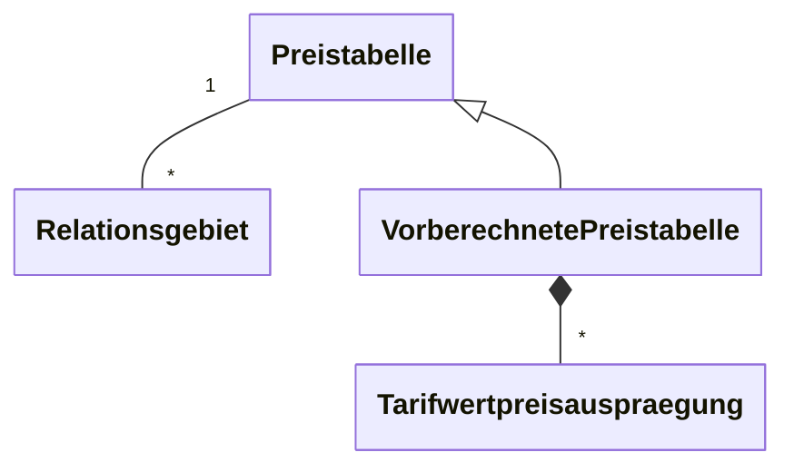

## Preistabelle

```mermaid
---
  config:
    class:
      hideEmptyMembersBox: true
---
classDiagram
    direction TD

Preistabelle "1" -- "*" Relationsgebiet
Preistabelle <|-- VorberechnetePreistabelle

VorberechnetePreistabelle  *-- "*" Tarifwertpreisauspraegung

```
